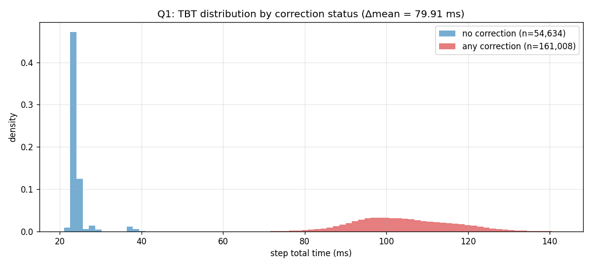
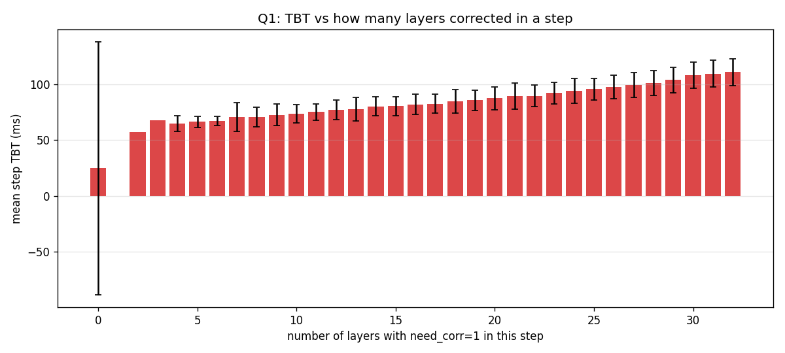
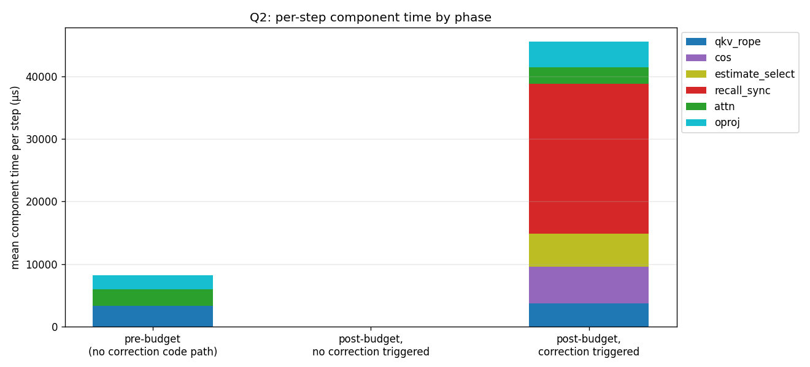
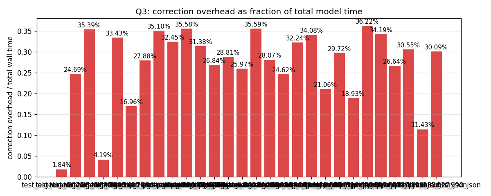
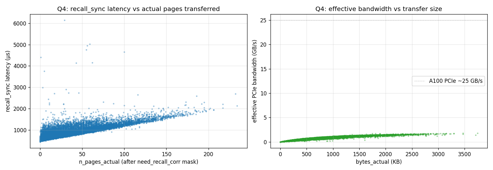

# `profile_aime` — systems profiling analysis

Source: `modal_logs/math50/math50`

Problems: ['test_algebra_1072_json', 'test_algebra_1349_json', 'test_algebra_1837_json', 'test_algebra_2193_json', 'test_algebra_2427_json', 'test_algebra_2584_json', 'test_counting_and_probability_119_json', 'test_counting_and_probability_134_json', 'test_counting_and_probability_525_json', 'test_geometry_434_json', 'test_geometry_627_json', 'test_intermediate_algebra_1000_json', 'test_intermediate_algebra_1197_json', 'test_intermediate_algebra_1388_json', 'test_intermediate_algebra_1454_json', 'test_intermediate_algebra_1994_json', 'test_intermediate_algebra_428_json', 'test_intermediate_algebra_607_json', 'test_number_theory_1032_json', 'test_number_theory_515_json', 'test_number_theory_627_json', 'test_number_theory_737_json', 'test_number_theory_864_json', 'test_prealgebra_1139_json', 'test_precalculus_1199_json', 'test_precalculus_285_json', 'test_precalculus_927_json', 'test_precalculus_990_json']

## Q1. How much longer does a step take when correction happens?

Per-step TBT bucketed by whether ANY layer fired `need_corr` in that step.

| pid | n_steps | n_steps_corr | TBT no_corr (ms) | TBT corr (ms) | Δ ms | Δ % |
|---|---|---|---|---|---|---|
| `test_algebra_1072_json` | 2,015 | 29 | 23.96 | 108.39 | 84.43 | 352.30% |
| `test_algebra_1349_json` | 2,978 | 1,274 | 25.49 | 105.85 | 80.36 | 315.24% |
| `test_algebra_1837_json` | 16,384 | 14,477 | 23.77 | 102.57 | 78.80 | 331.44% |
| `test_algebra_2193_json` | 2,096 | 92 | 24.45 | 88.27 | 63.82 | 261.03% |
| `test_algebra_2427_json` | 16,384 | 14,450 | 25.18 | 99.54 | 74.35 | 295.24% |
| `test_algebra_2584_json` | 2,564 | 580 | 24.90 | 103.84 | 78.95 | 317.09% |
| `test_counting_and_probability_119_json` | 3,975 | 1,976 | 24.30 | 115.09 | 90.78 | 373.52% |
| `test_counting_and_probability_134_json` | 16,384 | 14,404 | 23.87 | 115.12 | 91.25 | 382.27% |
| `test_counting_and_probability_525_json` | 9,727 | 7,748 | 25.31 | 98.61 | 73.30 | 289.57% |
| `test_geometry_434_json` | 16,384 | 14,499 | 24.22 | 103.97 | 79.76 | 329.35% |
| `test_geometry_627_json` | 5,295 | 3,314 | 24.49 | 118.04 | 93.55 | 382.06% |
| `test_intermediate_algebra_1000_json` | 4,174 | 2,190 | 23.67 | 92.73 | 69.06 | 291.70% |
| `test_intermediate_algebra_1197_json` | 4,621 | 2,649 | 24.16 | 98.08 | 73.92 | 305.95% |
| `test_intermediate_algebra_1388_json` | 3,910 | 1,958 | 24.51 | 95.99 | 71.48 | 291.64% |
| `test_intermediate_algebra_1454_json` | 16,384 | 14,427 | 23.80 | 115.51 | 91.71 | 385.26% |
| `test_intermediate_algebra_1994_json` | 4,835 | 2,914 | 25.31 | 112.78 | 87.47 | 345.55% |
| `test_intermediate_algebra_428_json` | 3,100 | 1,097 | 23.99 | 112.21 | 88.22 | 367.66% |
| `test_intermediate_algebra_607_json` | 8,223 | 6,221 | 24.67 | 97.82 | 73.15 | 296.58% |
| `test_number_theory_1032_json` | 16,384 | 14,377 | 23.99 | 99.00 | 75.01 | 312.63% |
| `test_number_theory_515_json` | 3,424 | 1,412 | 37.15 | 96.47 | 59.33 | 159.72% |
| `test_number_theory_627_json` | 4,312 | 2,322 | 24.18 | 117.05 | 92.87 | 384.14% |
| `test_number_theory_737_json` | 2,687 | 724 | 24.18 | 92.35 | 68.17 | 281.89% |
| `test_number_theory_864_json` | 16,384 | 14,376 | 25.43 | 108.87 | 83.45 | 328.20% |
| `test_prealgebra_1139_json` | 16,384 | 14,494 | 24.07 | 97.49 | 73.42 | 304.97% |
| `test_precalculus_1199_json` | 3,546 | 1,722 | 23.69 | 97.30 | 73.61 | 310.68% |
| `test_precalculus_285_json` | 5,344 | 3,357 | 23.94 | 114.72 | 90.78 | 379.27% |
| `test_precalculus_927_json` | 2,298 | 333 | 23.95 | 85.69 | 61.74 | 257.83% |
| `test_precalculus_990_json` | 5,446 | 3,592 | 23.59 | 96.65 | 73.06 | 309.69% |

**Pooled across all 5 problems:**
- TBT mean (no correction): 24.81 ms
- TBT mean (any correction): 104.72 ms
- **Δ mean: 79.91 ms** (322.14% relative)

## Q2. Slowest component, with vs without correction

Per-step component time (sum across 32 layers), µs. Three phases:
- **pre_budget** — KV under budget, no correction code path runs at all.
- **post_no_corr** — past budget, cos check ran, no layer fired need_corr.
  This bucket is essentially empty on AIME because at 89% per-(step, layer) trigger rate, P(no layer fires across 32 layers) ≈ 0.
- **post_corr** — past budget, ≥1 layer corrected. Almost all post-budget steps fall here.

| component | pre_budget (µs) | post_no_corr (µs) | post_corr (µs) |
|---|---|---|---|
| qkv_rope | 3322.6 | 0.0 | 3753.9 |
| cos | nan | 0.0 | 5784.0 |
| estimate_select | nan | 0.0 | 5328.1 |
| recall_sync | nan | 0.0 | 23905.8 |
| attn | 2665.0 | 0.0 | 2641.9 |
| oproj | 2210.4 | 0.0 | 4113.8 |

**Caveat on the `cos` component:** our per-head sim caching adds an extra `.float().cpu().numpy()` per layer per step (32 fp32 values), which forces a GPU→CPU sync. So the `cos` time we measure is FreeKV's correction trigger cost PLUS our logging cost. Without per-head logging, cos would be much smaller.

## Q3. Correction overhead as fraction of total wall time

Overhead = `cos + estimate_select + recall_sync` per step.

| pid | TBT mean (ms) | cos (µs) | trigger (µs) | overhead total fraction |
|---|---|---|---|---|
| `test_algebra_1072_json` | 25.18 | 100.4 | 364.0 | 0.0184 (1.84%) |
| `test_algebra_1349_json` | 59.87 | 2513.1 | 12269.3 | 0.2469 (24.69%) |
| `test_algebra_1837_json` | 93.40 | 4697.1 | 28356.9 | 0.3539 (35.39%) |
| `test_algebra_2193_json` | 27.25 | 214.5 | 927.0 | 0.0419 (4.19%) |
| `test_algebra_2427_json` | 90.76 | 4258.8 | 26086.7 | 0.3343 (33.43%) |
| `test_algebra_2584_json` | 42.76 | 1165.6 | 6086.5 | 0.1696 (16.96%) |
| `test_counting_and_probability_119_json` | 69.43 | 3539.3 | 15821.0 | 0.2788 (27.88%) |
| `test_counting_and_probability_134_json` | 104.10 | 6426.8 | 30112.3 | 0.3510 (35.10%) |
| `test_counting_and_probability_525_json` | 83.70 | 3797.6 | 23359.7 | 0.3245 (32.45%) |
| `test_geometry_434_json` | 94.80 | 4937.4 | 28795.8 | 0.3558 (35.58%) |
| `test_geometry_627_json` | 83.04 | 4633.4 | 21422.4 | 0.3138 (31.38%) |
| `test_intermediate_algebra_1000_json` | 59.91 | 2503.2 | 13573.9 | 0.2684 (26.84%) |
| `test_intermediate_algebra_1197_json` | 66.54 | 3167.5 | 16003.1 | 0.2881 (28.81%) |
| `test_intermediate_algebra_1388_json` | 60.30 | 2425.7 | 13237.8 | 0.2597 (25.97%) |
| `test_intermediate_algebra_1454_json` | 104.55 | 6490.0 | 30726.1 | 0.3559 (35.59%) |
| `test_intermediate_algebra_1994_json` | 78.03 | 3553.1 | 18350.4 | 0.2807 (28.07%) |
| `test_intermediate_algebra_428_json` | 55.21 | 2577.0 | 11017.8 | 0.2462 (24.62%) |
| `test_intermediate_algebra_607_json` | 80.01 | 3815.1 | 21982.7 | 0.3224 (32.24%) |
| `test_number_theory_1032_json` | 89.81 | 4434.6 | 26169.8 | 0.3408 (34.08%) |
| `test_number_theory_515_json` | 61.61 | 2104.1 | 10870.8 | 0.2106 (21.06%) |
| `test_number_theory_627_json` | 74.19 | 3844.1 | 18202.9 | 0.2972 (29.72%) |
| `test_number_theory_737_json` | 42.55 | 1303.3 | 6750.4 | 0.1893 (18.93%) |
| `test_number_theory_864_json` | 98.65 | 6044.1 | 29682.2 | 0.3622 (36.22%) |
| `test_prealgebra_1139_json` | 89.02 | 4280.0 | 26153.9 | 0.3419 (34.19%) |
| `test_precalculus_1199_json` | 59.44 | 2746.7 | 13088.1 | 0.2664 (26.64%) |
| `test_precalculus_285_json` | 80.97 | 4362.1 | 20375.7 | 0.3055 (30.55%) |
| `test_precalculus_927_json` | 32.89 | 640.7 | 3118.7 | 0.1143 (11.43%) |
| `test_precalculus_990_json` | 71.78 | 3382.8 | 18213.9 | 0.3009 (30.09%) |

## Q4. Recall latency and bandwidth vs pages-actually-transferred

Joined `recall_sync` timing with the recall log (4,642,645 correction events).

- Mean recall_sync latency: **901.1 µs**
- Median: 852.7 µs, p99: 1702.2 µs
- Mean pages actually transferred (after mask): **37.6** of 256 top-k slots
- Mean bytes actually transferred: **602.1 KB**
- Effective PCIe bandwidth: mean **0.62 GB/s** (p50 0.60, p99 1.50; A100 practical peak ~25 GB/s)
- Pearson correlation `n_pages_actual` ↔ `recall_sync_us`: **0.7755**

