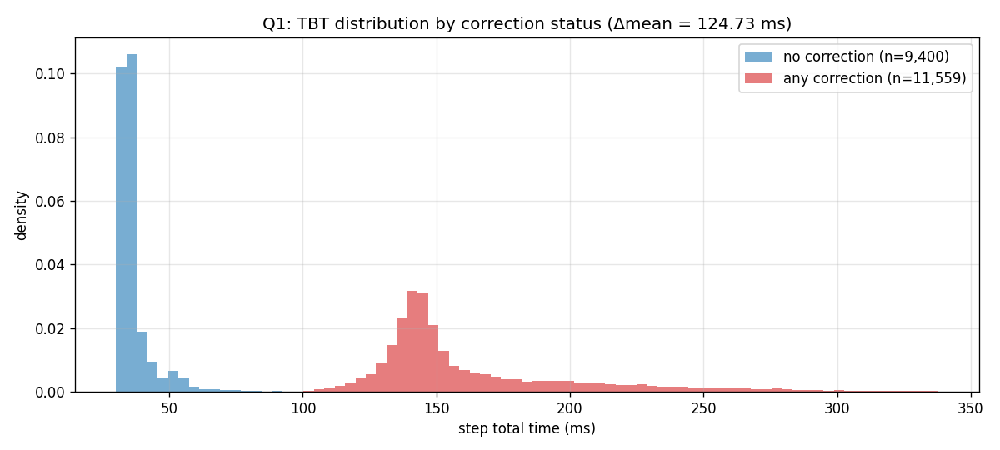
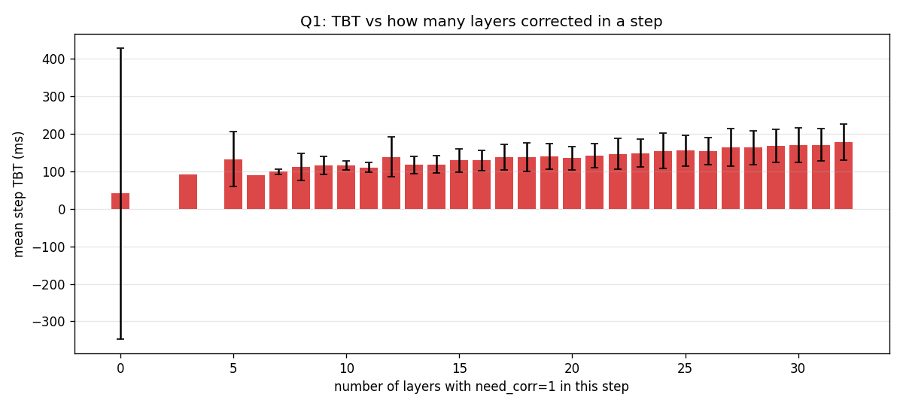
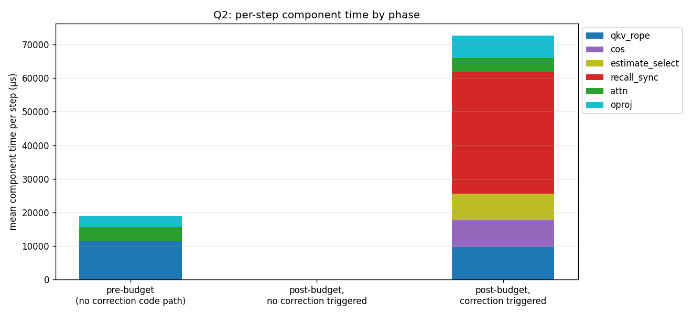
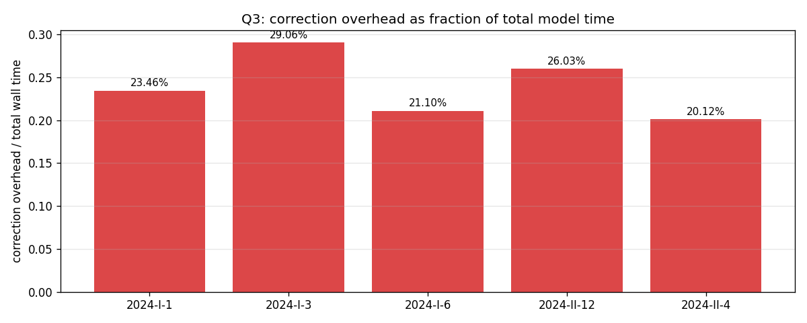
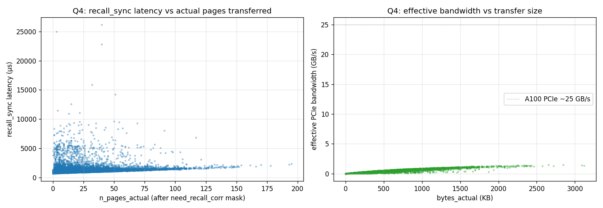

# `profile_aime` — systems profiling analysis

Source: `modal_logs/profile_aime/profile_aime`

Problems: ['2024-I-1', '2024-I-3', '2024-I-6', '2024-II-12', '2024-II-4']

## Q1. How much longer does a step take when correction happens?

Per-step TBT bucketed by whether ANY layer fired `need_corr` in that step.

| pid | n_steps | n_steps_corr | TBT no_corr (ms) | TBT corr (ms) | Δ ms | Δ % |
|---|---|---|---|---|---|---|
| `2024-I-1` | 3,011 | 1,114 | 39.35 | 231.66 | 192.31 | 488.76% |
| `2024-I-3` | 7,517 | 5,583 | 34.11 | 164.69 | 130.57 | 382.77% |
| `2024-I-6` | 2,737 | 905 | 36.20 | 160.07 | 123.87 | 342.20% |
| `2024-II-12` | 4,345 | 2,493 | 35.94 | 150.71 | 114.77 | 319.30% |
| `2024-II-4` | 3,349 | 1,464 | 57.58 | 145.77 | 88.19 | 153.16% |

**Pooled across all 5 problems:**
- TBT mean (no correction): 40.64 ms
- TBT mean (any correction): 165.37 ms
- **Δ mean: 124.73 ms** (306.90% relative)

## Q2. Slowest component, with vs without correction

Per-step component time (sum across 32 layers), µs. Three phases:
- **pre_budget** — KV under budget, no correction code path runs at all.
- **post_no_corr** — past budget, cos check ran, no layer fired need_corr.
  This bucket is essentially empty on AIME because at 89% per-(step, layer) trigger rate, P(no layer fires across 32 layers) ≈ 0.
- **post_corr** — past budget, ≥1 layer corrected. Almost all post-budget steps fall here.

| component | pre_budget (µs) | post_no_corr (µs) | post_corr (µs) |
|---|---|---|---|
| qkv_rope | 11531.4 | 0.0 | 9712.3 |
| cos | nan | 0.0 | 7993.1 |
| estimate_select | nan | 0.0 | 7822.5 |
| recall_sync | nan | 0.0 | 36391.7 |
| attn | 4006.6 | 0.0 | 3995.9 |
| oproj | 3292.3 | 0.0 | 6738.5 |

**Caveat on the `cos` component:** our per-head sim caching adds an extra `.float().cpu().numpy()` per layer per step (32 fp32 values), which forces a GPU→CPU sync. So the `cos` time we measure is FreeKV's correction trigger cost PLUS our logging cost. Without per-head logging, cos would be much smaller.

## Q3. Correction overhead as fraction of total wall time

Overhead = `cos + estimate_select + recall_sync` per step.

| pid | TBT mean (ms) | cos (µs) | trigger (µs) | overhead total fraction |
|---|---|---|---|---|
| `2024-I-1` | 110.50 | 3792.2 | 22134.4 | 0.2346 (23.46%) |
| `2024-I-3` | 131.09 | 5795.7 | 32299.6 | 0.2906 (29.06%) |
| `2024-I-6` | 77.15 | 2469.6 | 13813.1 | 0.2110 (21.10%) |
| `2024-II-12` | 101.79 | 3995.6 | 22500.3 | 0.2603 (26.03%) |
| `2024-II-4` | 96.13 | 3269.5 | 16071.9 | 0.2012 (20.12%) |

## Q4. Recall latency and bandwidth vs pages-actually-transferred

Joined `recall_sync` timing with the recall log (330,577 correction events).

- Mean recall_sync latency: **1241.2 µs**
- Median: 1092.1 µs, p99: 4940.6 µs
- Mean pages actually transferred (after mask): **22.6** of 256 top-k slots
- Mean bytes actually transferred: **361.8 KB**
- Effective PCIe bandwidth: mean **0.30 GB/s** (p50 0.25, p99 1.02; A100 practical peak ~25 GB/s)
- Pearson correlation `n_pages_actual` ↔ `recall_sync_us`: **0.1754**

